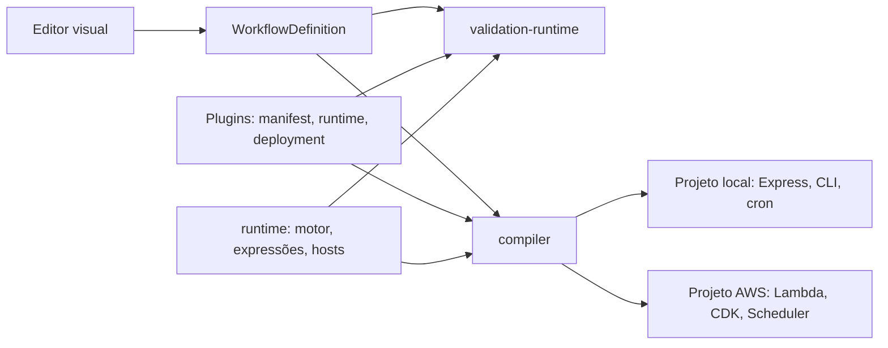

# Arquitetura e contratos

## Do canvas ao backend



O editor e os backends exportados executam o **mesmo código**. `@runflux/runtime` contém o motor do grafo, as expressões, as condições, a composição de campos, o cliente HTTP e os hosts. O editor o executa a partir do código-fonte; o compilador o empacota, junto com os plugins usados, em cada projeto exportado. O compilador não gera código de execução: ele gera **dados** (`workflow.json`, `infrastructure.json`, `package.json`) e copia templates estáticos.

## Pacotes

| Pacote | Responsabilidade | Depende de |
| --- | --- | --- |
| `workflow-model` | Modelo do fluxo, ordem topológica, detecção de ciclos | — |
| `runtime` | Contratos de nó, motor, expressões, condições, campos, cron, HTTP, hosts Express/Lambda/cron/CLI | — |
| `plugin-system` | Contrato de plugin, descoberta, registro, manifestos, hub de webhooks de teste | `runtime` |
| `expression-engine` | Fachada de expressões usada pelos previews do editor | `runtime` |
| `validation-runtime` | Execuções de teste do editor sobre o motor do runtime | `runtime`, `plugin-system` |
| `compiler` | Validação, plano de deployment, alvos local/AWS, empacotamento do runtime | `runtime`, `plugin-system`, `workflow-model` |

O núcleo de `@runflux/runtime` (`.`) não importa módulos do Node, porque o editor o empacota para o navegador. Os hosts ficam em subpaths (`/express`, `/lambda`, `/cron`, `/cli`), e um teste garante essa fronteira.

## Contrato de plugin

Um plugin é um pacote em `plugins/<id>/` com dois módulos:

- **`runtime.ts`**, que é executado. Exporta por padrão uma `NodeDefinition`, criada com `defineNode`, e contém a classe do handler. Importa apenas `@runflux/runtime`, os próprios arquivos e os pacotes npm que declara. O empacotador rejeita imports de pacotes do editor.
- **`index.ts`**, que descreve o plugin. Exporta `manifest`, `runtimeModule` (a URL do `runtime.ts`) e, quando precisa, `deployment`. Não importa o `runtime.ts`: o que os dois compartilham (leitura de parâmetros, constantes de saídas) fica em módulos próprios, como `parameters.ts`, `schedule.ts` e `outputs.ts`, para que o catálogo do editor não carregue drivers como o `pg`.

```ts
// runtime.ts
export class LogNode implements NodeHandler<LogParameters> {
  constructor(private readonly logger: Logger) {}
  execute({ parameters, input }: NodeInvocation<LogParameters>) {
    this.logger.info(`[log-output] ${parameters.label}:`, input);
    return NodeOutput.main(input);
  }
}

export default defineNode<LogParameters>({
  parseParameters: (parameters) => ({ label: parameters.string('label', 'Log') }),
  createHandler: ({ logger }) => new LogNode(logger),
});
```

- `parseParameters(reader)` recebe os parâmetros com as expressões `{{ }}` já resolvidas pelo motor e devolve um objeto tipado. Os valores padrão declarados no manifesto já vêm aplicados pelo `ExecutableWorkflowBuilder`, então o fluxo roda como o editor mostra. O `ParameterReader` rejeita tipos errados com mensagens como `set: parameter "fields" must be a list`. Parâmetros com `expressions: false` no manifesto (código-fonte, SQL) chegam literais.
- `createHandler(services)` recebe as dependências injetadas: `http`, `logger`, `clock`, `triggerEvents` e `extensions` (serviços específicos de plugin, chaveados por nome). Cada motor cria um handler por tipo de nó e o reaproveita; `dispose()` libera o que o handler criou, como pools de conexão. Um serviço injetado pertence a quem o injetou e não é fechado pelo handler.
- Todo handler devolve um `NodeOutput`: `NodeOutput.main(valor)` ou `NodeOutput.route(valor, saída)`. Uma saída `null` encerra o ramo sem erro. O motor rejeita saídas que o manifesto não declara.

`deployment` declara o que o plugin contribui para o backend exportado, e o compilador não conhece plugins pelo id:

| Campo | Exemplo |
| --- | --- |
| `triggers(parameters)` | O webhook declara uma rota HTTP; o cron, um agendamento |
| `environment(parameters)` | O segredo do webhook, a string de conexão do banco |
| `dependencies` / `devDependencies` | `pg` para o banco |
| `compose` | Serviço PostgreSQL e volume para o Docker Compose local |

O manifesto também descreve como o editor apresenta cada parâmetro, sem que a interface reconheça parâmetros pelo nome:

| Campo | Efeito no editor |
| --- | --- |
| `options` | Um select; com `allowCustomOptions`, sugestões num campo livre (ex.: presets de cron) |
| `showWhen` | O parâmetro só aparece enquanto outro tem um dos valores (ex.: o segredo do webhook) |
| `language` | Editor de código (`javascript`, `sql`) |
| `rowSchema` | Linhas estruturadas para listas de objetos (campos, condições, regras) |

O validador de manifestos confere essas declarações (opções só em `string`, padrão entre as opções, `showWhen` apontando para um parâmetro existente). As opções de operadores das condições derivam da tabela de operadores do runtime, e o compilador de TypeScript exige um rótulo para cada operador novo.

Os contratos entre runtime, plugins e hosts são estruturais: chaves de serviço comparam por nome, e o motor não usa `instanceof` com objetos de plugins. Isso é necessário porque o editor e os plugins podem carregar cópias distintas do runtime.

## Motor de execução

`WorkflowEngine` executa um `ExecutableWorkflow`, construído a partir do fluxo do editor pelo `ExecutableWorkflowBuilder` ou lido do `workflow.json` com `parseExecutableWorkflow`.

- Um run começa pelos triggers, todos ou o indicado em `triggerId`. Apenas os nós alcançáveis participam.
- Cada nó espera só os próprios pais, então ramos independentes correm em paralelo. Um nó executa quando ao menos um pai ativou a conexão até ele. Recebe o payload quando não tem pais, a saída do pai quando tem um, e a lista das saídas ativas, na ordem das conexões, quando tem vários.
- Uma falha fica registrada no nó e interrompe só os descendentes. `WorkflowExecution` informa o status (`success`, `partial`, `error`), as saídas e o resultado, que são as saídas das folhas.
- Triggers do mesmo plugin disputam entre si: quando um conclui, o `signal` dos outros é abortado e os perdedores não entram no registro. No editor, a espera de webhooks vem do `WebhookTestHub`, injetado como `triggerEvents`; sem ele, o webhook de teste usa o payload de exemplo. Em produção, um webhook sem requisição recebe uma requisição vazia, nunca o exemplo.
- `$node` contém apenas os ancestrais do nó (por id, e também pelo rótulo quando não conflita com um id), então ramos paralelos não dependem da ordem em que terminam.
- Campos tipados aceitam o valor ou o seu texto: `"42"` como número, `"true"` como booleano, `["a"]` e `{"a":1}` em texto JSON como lista e objeto.
- `run({ signal })` cancela um run: os nós em execução recebem o `signal` abortado e nenhum outro nó começa. O Express aborta o run quando o cliente desconecta, e o editor faz o mesmo nas execuções de teste.
- `runNode(id, { previous })` testa um nó isolado: a entrada vem dos registros bem-sucedidos dos pais e `$node`, dos ancestrais.
- `dispose()` espera os runs em andamento, libera os handlers e recusa runs posteriores. Quem cria o motor o descarta: os templates exportados no desligamento, a validation-runtime ao fim de cada execução de teste. Os hosts nunca descartam o motor que recebem.

As expressões são lidas por um analisador que respeita strings e chaves do JavaScript, então `{{ "}}" }}` e `{{ { a: 1 } }}` são expressões únicas. Cron usa `CronExpression`, que valida os cinco campos, nomes de meses e dias e passos, e serve tanto ao plugin quanto à tradução para AWS.

## Projeto exportado

```
src/workflow.json        documento executável (dados)
src/workflow.ts          ponto de composição: WorkflowEngine.fromDocument(workflow.json, plugins)
src/server.ts            host Express (local); com cron, também o host de agendamentos
src/run.ts               CLI (local, opcional: includeCli, desligada por padrão no editor)
src/run-cron.ts          worker de agendamentos (local, se houver cron)
src/lifecycle.ts         desligamento em SIGINT/SIGTERM: para hosts, espera runs, descarta o motor
src/handler.ts           handler Lambda (AWS)
lib/, bin/, infrastructure.json   stack CDK e seus dados (AWS)
vendor/runflux-runtime/  runtime + plugins usados, em JS compilado com tipos .d.ts (só os hosts que o projeto importa)
```

Os arquivos de `src/`, `lib/` e `bin/` vêm de `packages/compiler/templates/` sem alteração. São TypeScript real, verificado por `npm run typecheck`. O projeto depende de `@runflux/runtime` via `file:./vendor/runflux-runtime`, e o módulo `@runflux/runtime/plugins` do vendor contém as definições dos plugins daquele fluxo.

`BuildProfile` define como cada alvo empacota `dist/`, e dele derivam tanto o script `npm run build` do projeto quanto o build que o servidor executa antes de oferecer o download. Os dois resolvem `@runflux/runtime` a partir de `vendor/`, com ou sem `npm install`. O perfil fica registrado em `runflux-build.json`. As versões de `express`, `cors` e `node-cron` vêm do `package.json` do runtime, e os dois alvos compartilham as versões das ferramentas de build.

O compilador rejeita, com o código `INVALID_WORKFLOW`, contribuições de plugins que se contradizem: versões diferentes do mesmo pacote (inclusive dos pacotes dos hosts), serviços Compose homônimos diferentes ou reservados (`app`, `cron`), nomes de variáveis de ambiente inválidos, webhooks que respondem à mesma requisição e webhooks em `/health` ou `/api/execute`. Um alvo desconhecido é `UNSUPPORTED_TARGET`; uma falha ao empacotar o runtime é `GENERATOR_ERROR`, que o servidor responde com 500.

## Destinos

**Local**: servidor Express com uma rota por webhook (401 sem o segredo, que nunca chega ao fluxo; 405 para outros métodos; 404 em JSON; HEAD responde como GET; `/api/execute` só quando não há webhooks), CLI, worker cron, Dockerfile e Compose com os serviços que os plugins declaram e, se houver agendamentos, o serviço `cron`. O `.env.example` cita os valores quando preciso, para que dotenv e Compose os leiam como escritos.

**AWS**: Lambda Node.js 22 com o mesmo roteamento e a mesma autenticação do Express. A stack CDK lê `infrastructure.json`: a function URL existe só quando há webhooks, as variáveis de ambiente e um EventBridge Scheduler por cron. O código da função é `dist/` (`npm run deploy` compila e publica). A tradução de cron converte os dias da semana para a numeração e a sintaxe do EventBridge e rejeita o que ele não consegue preservar, como restringir o dia do mês e o dia da semana ao mesmo tempo.

## Editor

O editor executa os plugins no processo do Vite. Um único `PluginRegistryCache` atende o catálogo e as execuções de teste: a descoberta roda uma vez e de novo quando um arquivo de um diretório de plugins muda. Plugins em TypeScript são importados pelo tsx sem cache, então os módulos auxiliares também recarregam. Uma requisição de teste interrompida pelo cliente cancela o run.

As execuções de teste leem as variáveis do projeto aberto como `$env`, antes das variáveis do processo do Vite, assim como o backend exportado lê o seu `.env`. `npm run examples:seed` grava os workflows de `examples/` como projetos, e `npm run examples:postgres` sobe um PostgreSQL local (PGlite) para o exemplo de banco.

Nas execuções de teste, cada webhook espera no `WebhookTestHub` pela sua rota (`POST /items`), e as requisições enviadas à URL de teste são entregues pelo método e pelo caminho, como nos backends exportados: método exato antes de `ANY`, e HEAD como GET. Vários webhooks no mesmo caminho, um por método, podem ser testados no mesmo workflow. Com o hub, o webhook espera a requisição nos dois modos de execução; sem ele, o modo sandbox usa o payload de exemplo, e a produção, uma requisição vazia.

## Evolução com TDD

1. Descreva uma entrada e um resultado observável na interface pública afetada.
2. Adicione um teste e confirme que ele falha pelo motivo esperado.
3. Implemente e confirme o comportamento também no backend exportado quando ele for afetado (`tests/support/exported-project.ts`).
4. Centralize código duplicado preservando os testes.
5. Execute `npm test` e `npm run build`.

Para plugins, use `executeNode` de `@runflux/runtime/testing`, que executa um nó exatamente como o motor, e injete serviços em vez de mockar módulos. Serviços externos são substituídos na fronteira (transporte HTTP, driver do banco); operadores, expressões e grafo sempre executam de verdade.
