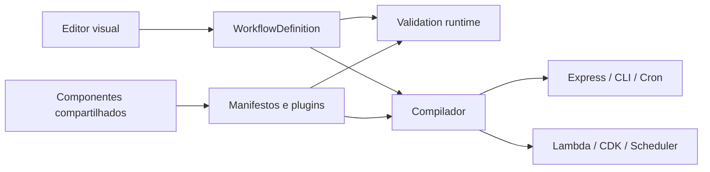

# Arquitetura e contratos

## Do canvas ao backend

`workflow-model` é independente da interface visual. Os dois caminhos recebem a mesma definição de nós, conexões, parâmetros e variáveis de ambiente. A ordenação topológica é compartilhada; ciclos e referências inválidas são rejeitados antes da geração.

## Contrato de plugin

Um pacote em `plugins/` exporta `manifest`, `execute` e `generators`. O manifesto descreve ID, versão, categoria, parâmetros, saídas e plataformas suportadas. `createCodeGenerators(manifest, render)` produz os geradores para exatamente as plataformas declaradas.

- `execute(params, input, context)` executa no editor; o contexto contém modo, identificação, cancelamento, `$node` e `$env`.
- `generators[platform](params, context)` retorna arquivos que exportam `run(input, context)`.
- Quando o manifesto declara `outputs`, a execução devolve `{ value, activeOutput }`. A saída ativa seleciona as conexões; um payload comum contendo uma propriedade `value` não é confundido com esse protocolo.
- Parâmetros são resolvidos pelo runtime antes de `execute`. `expressions: false` preserva código-fonte JavaScript e SQL literal. Valores SQL dinâmicos usam `queryParams`, com placeholders `$1`, `$2`, etc.

O primeiro arquivo retornado pelo gerador é o ponto de entrada do nó. Os arquivos ficam em diretórios próprios por instância (`src/nodes/node-N/`); duas instâncias do mesmo plugin nunca compartilham acidentalmente sua configuração. Caminhos absolutos, travessias de diretório e colisões são rejeitados.

## Reuso de implementação

`plugin-system` concentra o avaliador de expressões, operadores condicionais, composição de campos, contexto, cliente HTTP, configuração de webhooks e fila de listeners interativos. Editor e servidor entregam webhooks pela mesma fila tipada e pela mesma regra de correspondência de caminho.

`bundleStandalone` transforma essas implementações TypeScript em código independente. Evita manter uma segunda implementação em strings para os plugins compilados. O PostgreSQL usa o mesmo `queryDatabase` no editor em produção e no backend gerado; o driver permanece uma dependência externa declarada.

O compilador concentra a montagem do grafo e seu executor. Os templates local e AWS cuidam somente da integração com HTTP, agendamento e infraestrutura. Configuração de ambientes e enumeração dos agendamentos também são compartilhadas.

## Execução do grafo gerado

O grafo identifica triggers pela categoria do manifesto. Uma requisição ou agendamento seleciona seu trigger; apenas os nós alcançáveis a partir dele participam. Um merge aguarda todos os pais relevantes, recebe apenas entradas de conexões ativas e preserva a ordem definida pelas conexões. Falhas de nós produzem falha da execução.

## Destinos

Local gera Express, CLI, worker cron, Dockerfile e Compose. A aplicação HTTP é separada do processo que abre a porta, permitindo integração por requisições reais. Webhooks respeitam rota, método, cabeçalho de autenticação, segredo, query e corpo bruto/JSON. Segredo não configurado resulta em rejeição da autenticação.

AWS gera Lambda Node.js 22 e CDK. Cada cron possui seu próprio EventBridge Scheduler, timezone e identificação do trigger. A tradução de cron rejeita configurações Unix que não podem ser preservadas no destino. O ZIP de download contém o projeto completo; `compiled/function.zip` é o pacote de execução Lambda.

## Evolução com TDD

1. Descreva uma entrada e um resultado observável na interface pública afetada.
2. Adicione um teste e confirme que falha pelo comportamento esperado.
3. Corrija a implementação e confirme o resultado do módulo gerado quando houver geração de código.
4. Centralize código duplicado preservando os testes.
5. Execute `npm test` e `npm run build`.

Não teste apenas a presença de uma palavra no código gerado quando for possível executar o módulo e observar sua saída. Substitua serviços externos na fronteira (HTTP, driver de banco); preserve a execução real de operadores, expressões e grafo.
