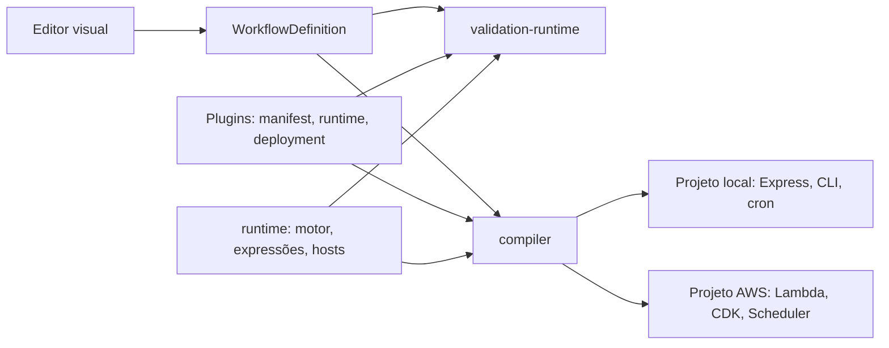

# Arquitetura e contratos

## Do canvas ao backend



O editor e os backends exportados executam o **mesmo código**. `@runflux/runtime` contém o motor do grafo, as expressões, as condições, a composição de campos, o cliente HTTP e os hosts. O editor o executa a partir do código-fonte; o compilador o empacota, junto com os plugins usados, em cada projeto exportado. O compilador não gera código de execução: ele gera **dados** (`workflow.json`, `infrastructure.json`, `package.json`) e copia templates estáticos.

## Pacotes

| Pacote | Responsabilidade | Depende de |
| --- | --- | --- |
| `workflow-model` | Modelo do fluxo, ordem topológica, detecção de ciclos | — |
| `runtime` | Contratos de nó, motor, expressões, condições, campos, HTTP, hosts Express/Lambda/cron/CLI | — |
| `plugin-system` | Contrato de plugin, descoberta, registro, manifestos, hub de webhooks de teste | `runtime` |
| `expression-engine` | Fachada de expressões usada pelos previews do editor | `runtime` |
| `validation-runtime` | Execuções de teste do editor sobre o motor do runtime | `runtime`, `plugin-system` |
| `compiler` | Validação, plano de deployment, alvos local/AWS, empacotamento do runtime | `runtime`, `plugin-system`, `workflow-model` |

O núcleo de `@runflux/runtime` (`.`) não importa módulos do Node, porque o editor o empacota para o navegador. Os hosts ficam em subpaths (`/express`, `/lambda`, `/cron`, `/cli`), e um teste garante essa fronteira.

## Contrato de plugin

Um plugin é um pacote em `plugins/<id>/` com dois módulos:

- **`runtime.ts`**, que é executado. Exporta por padrão uma `NodeDefinition`, criada com `defineNode`, e contém a classe do handler. Importa apenas `@runflux/runtime`, os próprios arquivos e os pacotes npm que declara. O empacotador rejeita imports de pacotes do editor.
- **`index.ts`**, que descreve o plugin. Exporta `manifest`, `runtimeModule` (a URL do `runtime.ts`) e, quando precisa, `deployment`.

```ts
// runtime.ts
export class LogNode implements NodeHandler<LogParameters> {
  constructor(private readonly logger: Logger) {}
  execute({ parameters, input }: NodeInvocation<LogParameters>) {
    this.logger.info(`[log-output] ${parameters.label}:`, input);
    return NodeOutput.main(input);
  }
}

export default defineNode<LogParameters>({
  parseParameters: (parameters) => ({ label: parameters.string('label', 'Log') }),
  createHandler: ({ logger }) => new LogNode(logger),
});
```

- `parseParameters(reader)` recebe os parâmetros com as expressões `{{ }}` já resolvidas pelo motor e devolve um objeto tipado. O `ParameterReader` aplica os valores padrão e rejeita tipos errados com mensagens como `set: parameter "fields" must be a list`. Parâmetros com `expressions: false` no manifesto (código-fonte, SQL) chegam literais.
- `createHandler(services)` recebe as dependências injetadas: `http`, `logger`, `clock`, `triggerEvents` e `extensions` (serviços específicos de plugin, chaveados por nome). Cada runtime cria um handler por tipo de nó e o reaproveita; `dispose()` libera recursos como pools de conexão.
- Todo handler devolve um `NodeOutput`: `NodeOutput.main(valor)` ou `NodeOutput.route(valor, saída)`. Uma saída `null` encerra o ramo sem erro. O motor rejeita saídas que o manifesto não declara.

`deployment` declara o que o plugin contribui para o backend exportado, e o compilador não conhece plugins pelo id:

| Campo | Exemplo |
| --- | --- |
| `triggers(parameters)` | O webhook declara uma rota HTTP; o cron, um agendamento |
| `environment(parameters)` | O segredo do webhook, a string de conexão do banco |
| `dependencies` / `devDependencies` | `pg` para o banco |
| `compose` | Serviço PostgreSQL e volume para o Docker Compose local |

Os contratos entre runtime, plugins e hosts são estruturais: chaves de serviço comparam por nome, e o motor não usa `instanceof` com objetos de plugins. Isso é necessário porque o editor e os plugins podem carregar cópias distintas do runtime.

## Motor de execução

`WorkflowEngine` executa um `ExecutableWorkflow`, construído a partir do fluxo do editor pelo `ExecutableWorkflowBuilder` ou lido do `workflow.json` com `parseExecutableWorkflow`.

- Um run começa pelos triggers, todos ou o indicado em `triggerId`. Apenas os nós alcançáveis participam.
- Cada nó espera só os próprios pais, então ramos independentes correm em paralelo. Um nó executa quando ao menos um pai ativou a conexão até ele. Recebe o payload quando não tem pais, a saída do pai quando tem um, e a lista das saídas ativas, na ordem das conexões, quando tem vários.
- Uma falha fica registrada no nó e interrompe só os descendentes. `WorkflowExecution` informa o status (`success`, `partial`, `error`), as saídas e o resultado, que são as saídas das folhas.
- Triggers do mesmo plugin disputam entre si: quando um conclui, o `signal` dos outros é abortado. No editor, a espera de webhooks vem do `WebhookTestHub`, injetado como `triggerEvents`; sem ele, o webhook usa o payload de exemplo.
- `runNode` testa um nó isolado com as saídas registradas anteriormente.

## Projeto exportado

```
src/workflow.json        documento executável (dados)
src/workflow.ts          ponto de composição: WorkflowEngine.fromDocument(workflow.json, plugins)
src/server.ts, run.ts    hosts Express e CLI (local)
src/run-cron.ts          worker de agendamentos (local, se houver cron)
src/handler.ts           handler Lambda (AWS)
lib/, bin/, infrastructure.json   stack CDK e seus dados (AWS)
vendor/runflux-runtime/  runtime + plugins usados, em JS compilado com tipos .d.ts
```

Os arquivos de `src/`, `lib/` e `bin/` vêm de `packages/compiler/templates/` sem alteração. São TypeScript real, verificado por `npm run typecheck`. O projeto depende de `@runflux/runtime` via `file:./vendor/runflux-runtime`, e o módulo `@runflux/runtime/plugins` do vendor contém as definições dos plugins daquele fluxo.

`BuildProfile` define como cada alvo empacota `dist/`, e dele derivam tanto o script `npm run build` do projeto quanto o build que o servidor executa antes de oferecer o download. O perfil fica registrado em `runflux-build.json`.

## Destinos

**Local**: servidor Express com uma rota por webhook (401 sem o segredo, 405 para outros métodos e `/api/execute` quando não há webhooks), CLI, worker cron, Dockerfile e Compose com os serviços que os plugins declaram.

**AWS**: Lambda Node.js 22 atrás de uma function URL, com o mesmo roteamento e a mesma autenticação do Express. A stack CDK lê `infrastructure.json`: variáveis de ambiente e um EventBridge Scheduler por cron. A tradução de cron rejeita expressões que o EventBridge não consegue preservar.

## Evolução com TDD

1. Descreva uma entrada e um resultado observável na interface pública afetada.
2. Adicione um teste e confirme que ele falha pelo motivo esperado.
3. Implemente e confirme o comportamento também no backend exportado quando ele for afetado (`tests/support/exported-project.ts`).
4. Centralize código duplicado preservando os testes.
5. Execute `npm test` e `npm run build`.

Para plugins, use `executeNode` de `@runflux/runtime/testing`, que executa um nó exatamente como o motor, e injete serviços em vez de mockar módulos. Serviços externos são substituídos na fronteira (transporte HTTP, driver do banco); operadores, expressões e grafo sempre executam de verdade.
